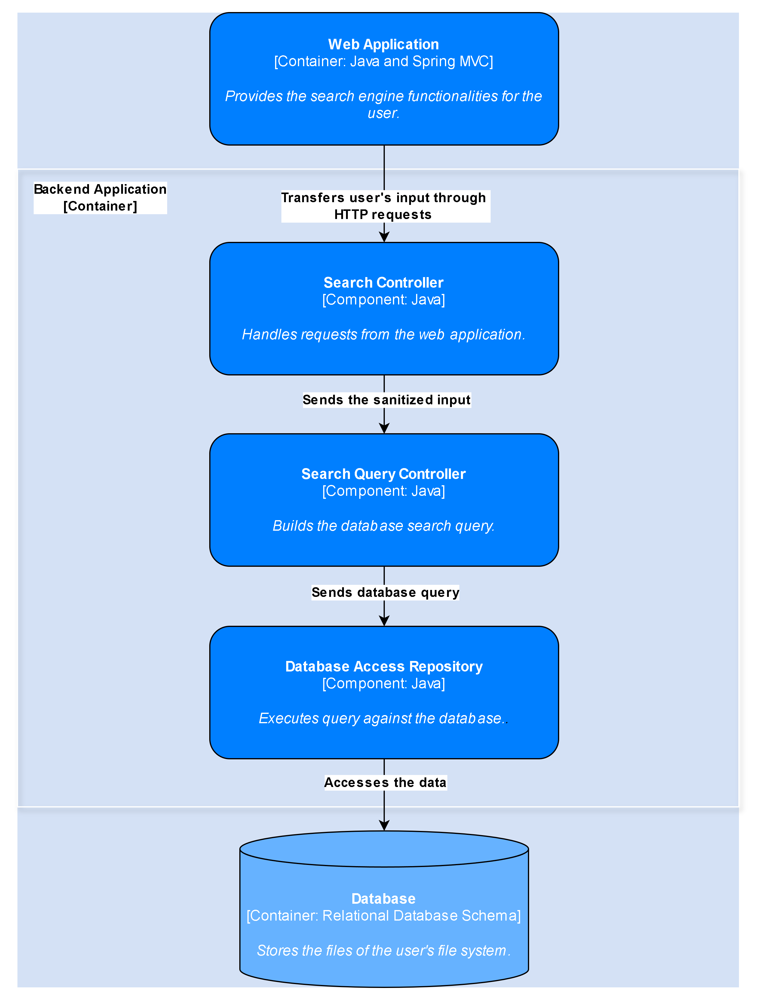
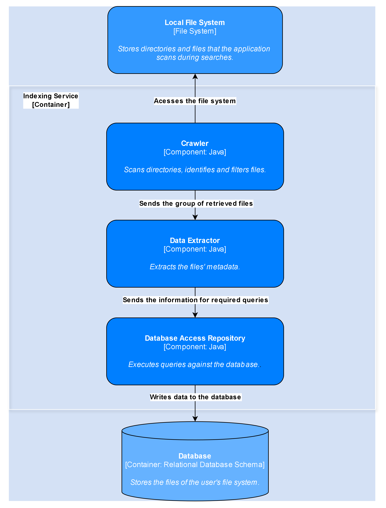

#   SEEKER - Local File Search Engine Architecture

##   1.  Introduction

This document describes the architecture of the "Seeker" local file search engine. The architecture is designed to be modular and maintainable allowing for efficient crawling, indexing, and searching of local files. I use the __C4 model__ to visualize and communicate the system's structure.

##   2.  System Context Diagram


The System Context Diagram shows the high-level view of the Seeker application.   
It illustrates the interaction between the user, the Seeker application, and the local file system:
- The user interacts with the application to search for files
- The application interacts with the local file system to access and index files
- The application returns to the user the files that match its request.

##   3.  Container Diagram


The Container Diagram illustrates the high-level technology choices and how responsibilities are distributed across different containers.

* **Web Application:**
    * Serves as the user-facing interface, providing the means for users to input search queries and view results. It's built using HTML, CSS and Thymeleaf, for a simple and responsive GUI.
* **Backend Application:**
    * Represents the core logic of the search engine, processing user requests, coordinating search operations, and managing file retrieval. It's designed with Java and Spring MVC.
* **Indexing Service:**
    * Operates as a background process responsible for keeping the search index up-to-date. It crawls the local file system, extracts relevant data, and populates the PostgreSQL database. Java and Spring MVC provide the framework for its operation.
* **PostgreSQL Database:**
    * Acts as the central repository for indexed file data, storing both metadata and extracted content. PostgreSQL was selected for its full-text search capabilities and data integrity features.


##   4.  Component Diagrams

###   4.1  Backend Application Components



The Backend Application container is composed of the following components:

* `   `**Search Controller:**
    * `   `   `Responsibility:
        * `   `   `   `Receives user input, performs basic validation and processing.
* `   `**Search Query Controller:**
    * `   `   `Responsibility:
        * `   `   `   `Receives the input and builds the corresponding query.
* `   `**Database Access Repository:**
    * `   `   `Responsibility:
        * `   `   `   `Handles communication with the PostgreSQL database, executes queries, and manages database interactions.

###   4.2  Indexing Service Components


The Indexing Service container is composed of the following components:

* `   `**Crawler Component:**
    * `   `   `Responsibility:
        * `   `   `   `Traverses the file system, identifies files, applies filtering rules, and manages the crawling process.
* `   `**Data Extractor Component:**
    * `   `   `Responsibility:
        * `   `   `   `Extracts metadata and content from files, using Apache Tika for content extraction, and structures the data for database storage.
* `   `**Database Access Repository:**
    * `   `   `Responsibility:
        * `   `   `   `Connects to the PostgreSQL database, writes extracted data, handles transactions, manages errors, and optimizes database writes.

##   5.  Database Schema

The Seeker application uses a relational database schema (PostgreSQL) to store file metadata and extracted content. The schema is designed to support efficient search and retrieval of files.

   ```sql
   CREATE TABLE files (
       id UUID PRIMARY KEY DEFAULT gen_random_uuid(),
       file_path TEXT UNIQUE NOT NULL,
       file_name TEXT NOT NULL,
       extension TEXT NOT NULL,
       size BIGINT NOT NULL,
       last_modified TIMESTAMP NOT NULL,
       content TEXT,  
       metadata JSONB 
   );
   ```

##   6.  Architectural Decisions

* `   `**Database Choice:** PostgreSQL was chosen for its robust relational capabilities and full-text search features.
* `   `**Full-Text Search:** PostgreSQL's full-text search capabilities with GIN indexes were selected to provide efficient and powerful content search.
* `   `**Technology Stack:** Java and Spring MVC were chosen for their maturity, robustness, and suitability for building scalable web applications and services.
* `   `**Apache Tika:** Apache Tika was integrated for its ability to extract content from a wide variety of file formats, simplifying content extraction.

##   7.  Diagramming Tool Used

* `   `Draw.io was used to create the diagrams in this document.

