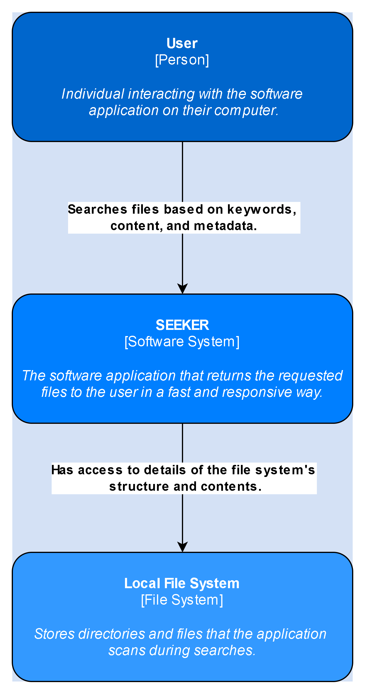

# SEARCH ENGINE FOR THE LOCAL FILE SYSTEM

This project implements the Software Application *Seeker*, which is designed as a search engine for the local system file of the computer. It is meant to fetch the user's input and return the required file in a fast and responsive way.    

The desktop application has multiple functionalities:<br>    

***Crawling & Indexing Local Content***
- The system will scan directories, extract metadata and content from files, and store the indexed data in the database
- Filtering is implemented to exclude specific types of files (hidden/system/temporary)
- The content from text-based files will be extracted using [**Apache Tika**](https://tika.apache.org/)
<br>

***Database Schema***
- Relational database: PostgreSQL
- For a fast search indexing: __GIN INDEX__ on content
- FuzzySearch for improved full-text search using built-in _ _tsvector_ _ and _ _tsquery_ _ types, that allow to search for words or phrases in large text fields
```sql
CREATE TABLE files (
    id UUID PRIMARY KEY DEFAULT gen_random_uuid(),
    file_path TEXT UNIQUE NOT NULL,
    file_name TEXT NOT NULL,
    extension TEXT NOT NULL,
    size BIGINT NOT NULL,
    last_modified TIMESTAMP NOT NULL,
    content TEXT,  
    metadata JSONB 
);
```
<br>

***Search and Query Processing***  
- The user enters a search query -> The system searches indexed filenames, metadata, and content -> The best-matching results are displayed instantly
- Storing recent searches in memory
- Incremental search, where results are displayed as the user types their query
- Using prepared statements or caching mechanisms in the application layer to avoid repeatedly executing the same queries, especially during rapid, repeated typing
<br>

***Result Presentation***
- Display the file's details: file name, size, last modified date
- Highlight matching keywords
<br>

## 1. System context diagram


## 2. Containers diagram


## 3. Components diagram

